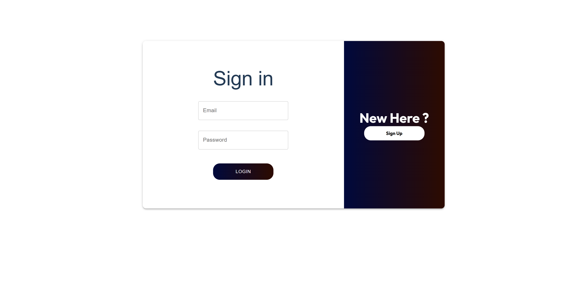
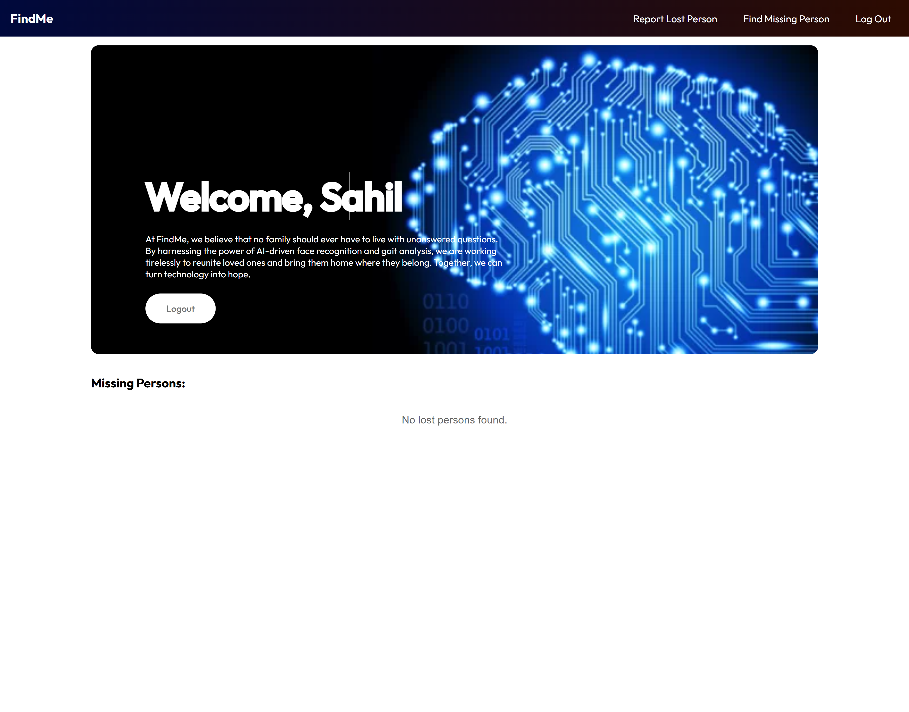
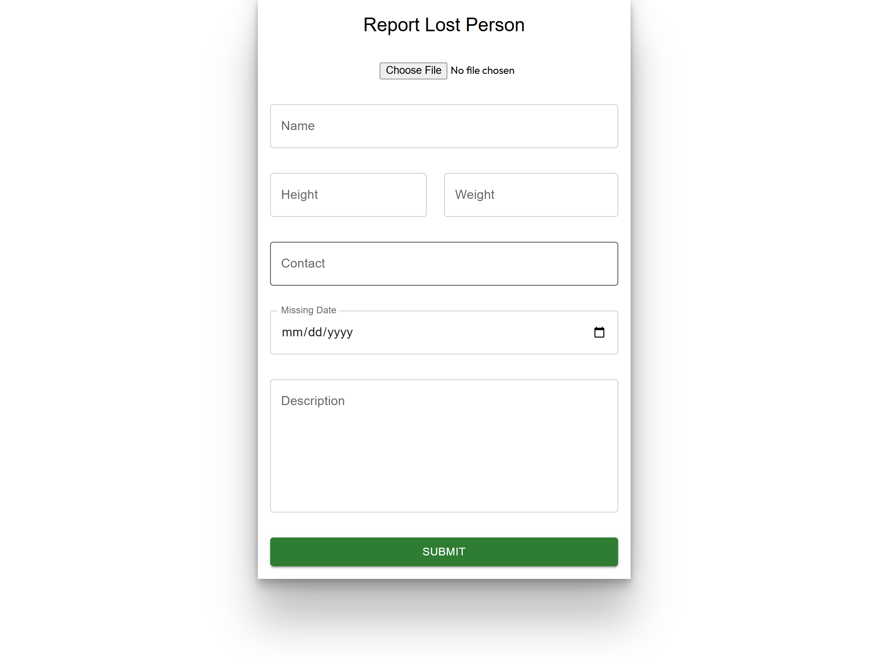
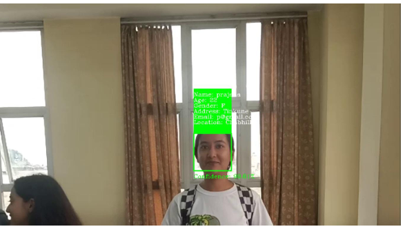
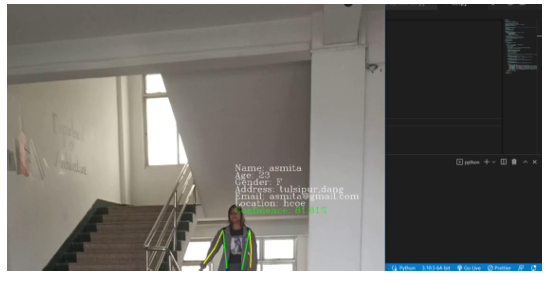

# FindMe

This is my final year project using MERN for UI and backend for user authorization and reporting lost person.
Used python for creating model and Fast API to integrate python model with MERN Project.

## Technologies Used

- React(for UI)
- MongoDB(for database)
- Express and NodeJs(for backend)
- JWT(for authentication)
- Cloudinary (for saving images)
- YUP (for form validation)
- MaterialUi(for components)

## Languages

- Javascript(Application)
- Python(Model Development)

## Team Members

- Sahil Shrestha (Me)
- Prajana Joshi
- Asmita K.C.
- Nanda singh Kadayat

## Application Screenshots

**Application UI**

---
**Model Output:**

## Video Demo

🎥 [Watch demo video](https://youtu.be/wYAmIwRiCGg)
